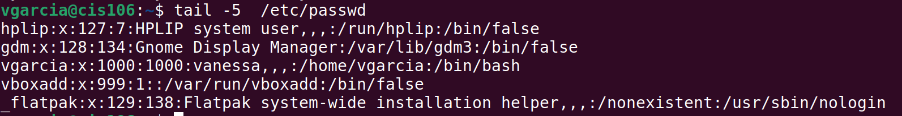

--
name: Vanessa Garcia
semester: Fall 23
course: cis106
---
# Lab 7

# Question 1
 
 
 
 
 

# Question 2
 
 
 
 

# Question 3
 
 
 
 

# Question 4
 
 
  
 
 
 
 
 
 
 
 
 
 
 
 

# Question 5
 
 
 
 
 
 
 
 
  
 
 
 
 
 
  
 
 
 
 
 
 
 
  

# Question 6
 
 
  
 

# Challenge Question 
 
 
  
 
 
 

