# Week Report 4

## Practice from the presentation The Linux File system: 
### Practice 1
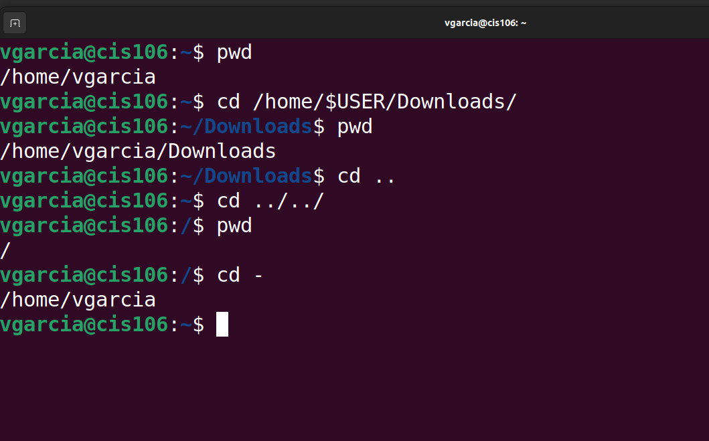 

### Practice 2
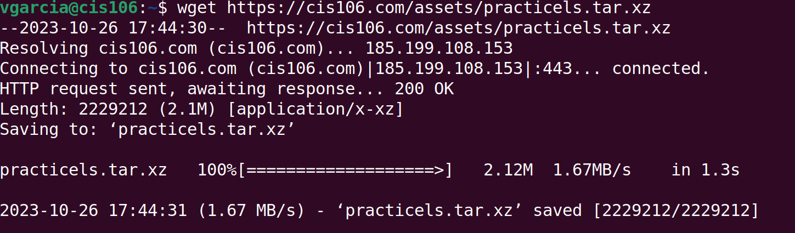 
 
 
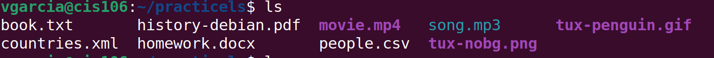 
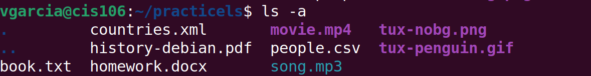 
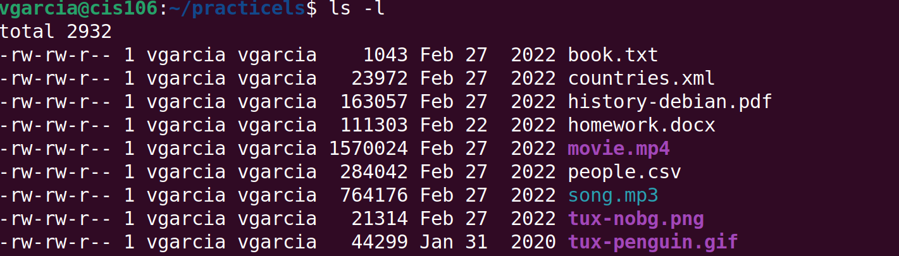 
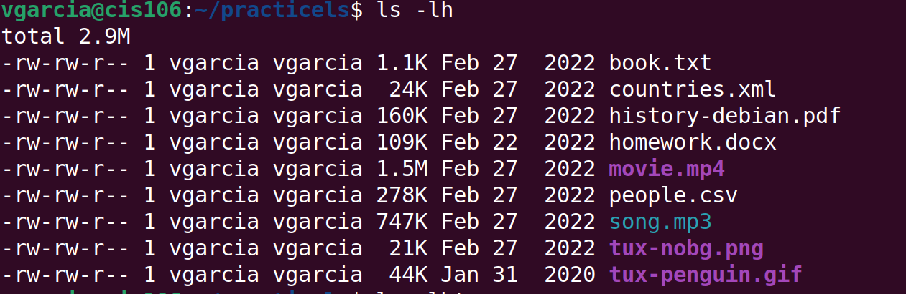 
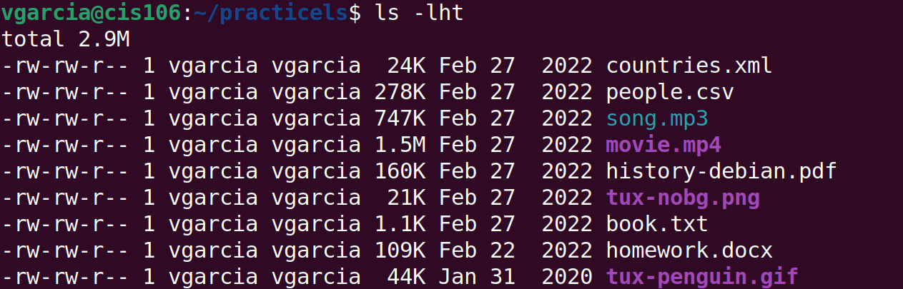 
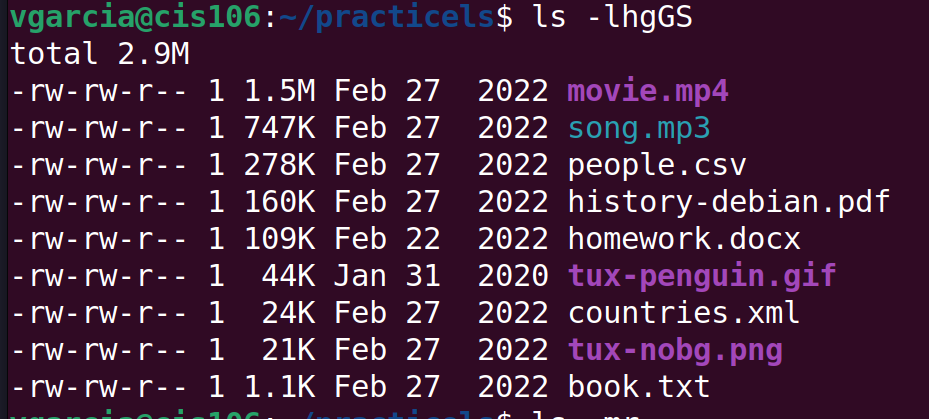 
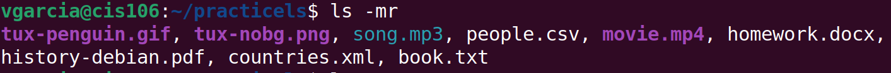 
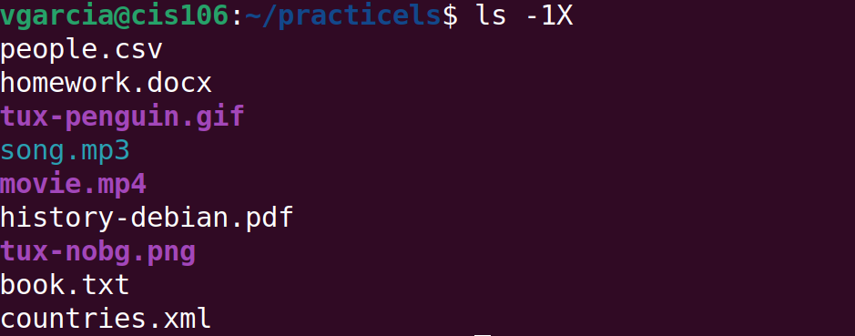 

### Practice 3
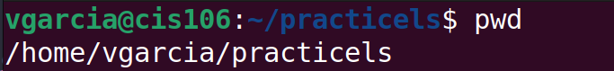 
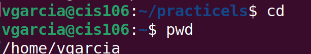 
 
 
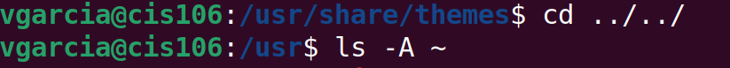 
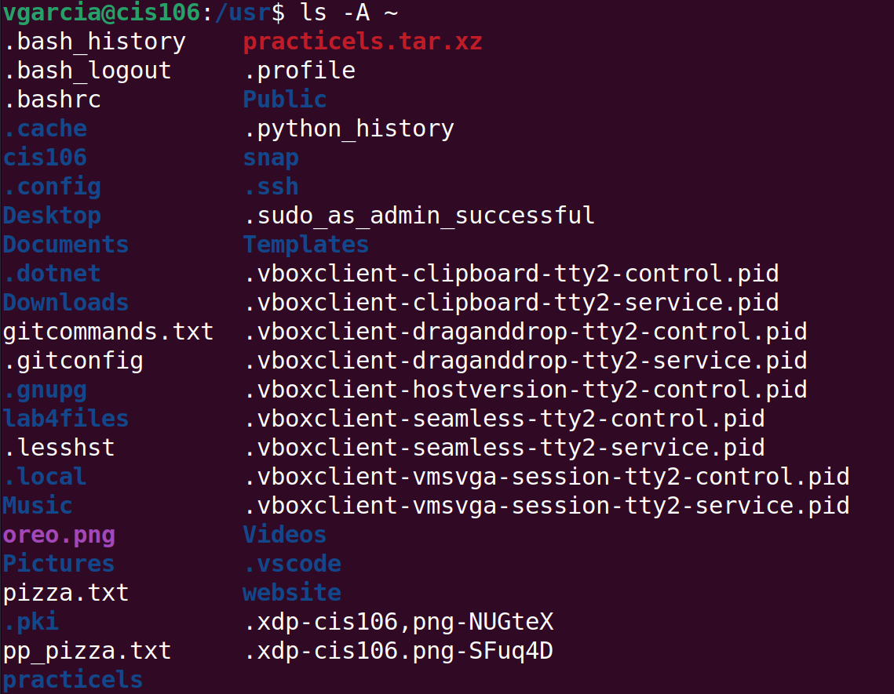 
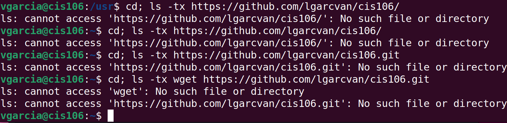 

## The Linux File system directories and their purpose:

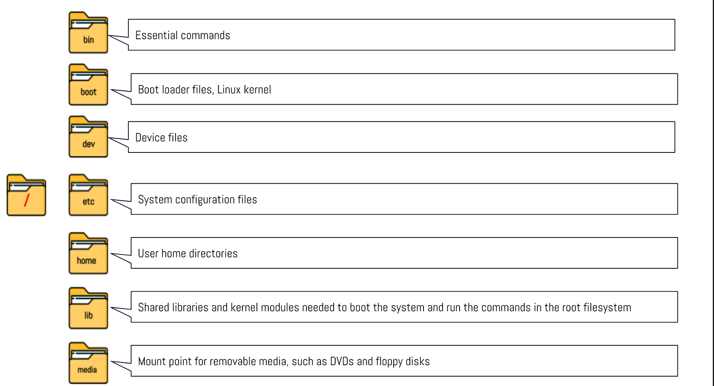 
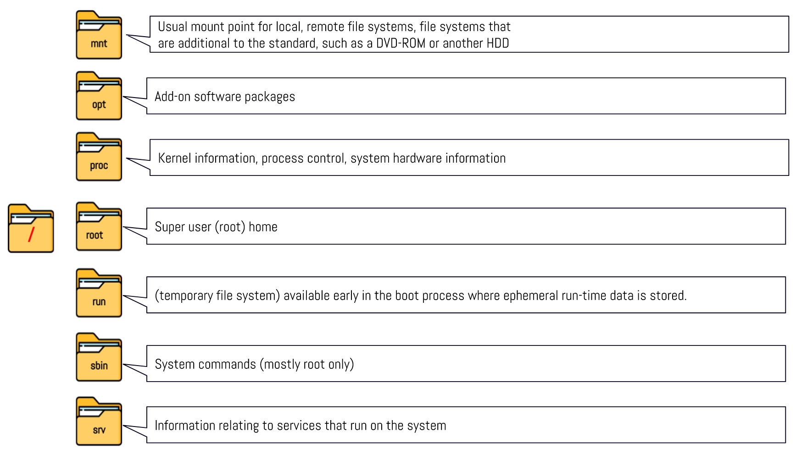 
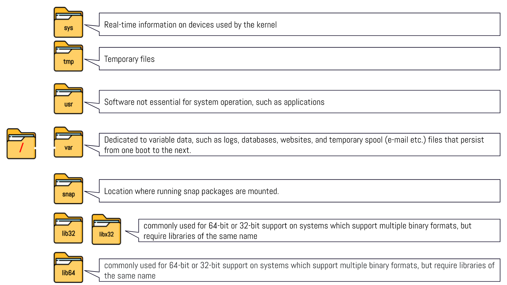 

## All the commands we use for navigating the file system

| Command | What is does                                      | Syntax                    | Example |
| ------- | ------------------------------------------------- | ------------------------- | ------- |
| pwd     | print current directory                           | pwd                       | 'pwd'   |
| CD      | changes the present working directory             | cd [source] [destination] | cd      |
| ls      | list all files & directories in a given directory | ls [options] [files]      | ls      |

## Basic Terminology

* File system
  the way files are stored & organized
 
* Current directory
  directory where you are at the moment or present working directory
 
* parent directory 
  move forward to a subdirectory or backwards to previous directory 
 
* The difference between your home directory and the home directory?
Home directory is the default working directory when a user logs in. Present working directory is user current directory. Working directory can be changed by cd command.
 
* pathname
  in a filesystem every file has pathname which indicates location of file in filesystem (address)
 
* Relative path 
  location or a directory that is located inside current working directory
  EX: Downloads/songs.mp3
 
* Absolute path
location of a file starting at root of FS
EX: /home/john/Downloads/songs.mp3
