# Week Report 5

## Answer following questions:

* What are Command Options?
  "Commands are often followed by" options that modify/enhance their behavior.
 
* What are Command Arguments?
  * "" Arguments which are the items the command acts on.This can be a file or directory.
     
* Which command is used for creating directories? 
  mkdir = mkdir + name of directory
* Provide at least 3 examples.
    * EX: create directory in different directory use Relative Path = mkdir wallpaper/ocean
      * EX: Absolute Path: mkdir = ~/wallpapers/forest 
    * EX: create multiple directories 'mkdir movies -/Downloads/games -/Documents/hw'
* create directory w/ parent(home) directory at the same time 
  * EX: create directory: assets.image/small inside website directory
      *  mkdir -p ~/website/assets/images/small
 
* What does the touch command do?
  touch command = create files

  * Provide at least 3 examples.
    * EX:create file (index.html) inside directory website = touch index.html
    * EX:create file inside website/assets/images/small called logo.png = 
    * touch ~/website/assets/images/small/logo.png 
    * EX:create file with space in name + touch "list of food.txt"  
 
* How do you remove a file? 
  rm command
  * Provide an example.
    * EX:remove script.sj & image.png file =
       * rm scripts/script.js assets/image.png
    * EX:script & assets directory = rmdir scripts/ assets/  
   
* How do you remove a directory and can you remove non-empty directories in Linux? 
* In linux you cannot remove non-empty directories :
  *EX: remove empty directory = rmdir
  *EX: remove non-empty directory = rm -r +directory name or direct absolute path
  *Provide an example
   * EX:remove non-empty = rm-r wallpapers
 
* Explain the mv and cp command.
* mv = move & rename directories
  * EX: move directory from one DL directory to website/assets directory = mv Downloads/picture website/assets/
* cp = copies files/directories from a source to destination
  * EX:cp + files to copy + destination
  * EX: cp Downloads/wallpapers.zip Pictures    
* To copy directories use -r
  * EX: cp -r   +directory to copy + destination
* Copy w/Abs Path= cp -r ~/Downloads/wallpapers ~Pictures/
  copy these files to docs directory inside website directory
   * EX: cp Downloads/sample1.doc website/docs/ 
  
##Complete all the Practices in the Presentation:

#Practice 1
 
 
 
 
 
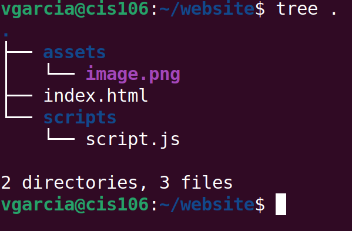 
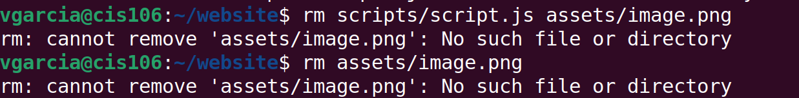 
 
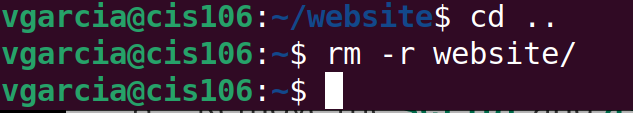 
 

#Practice 2
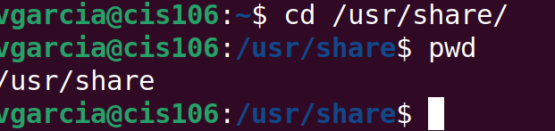 
 
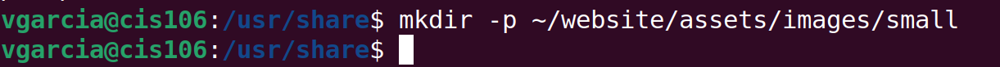 
 
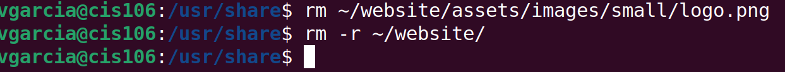 
 

#Practice 3
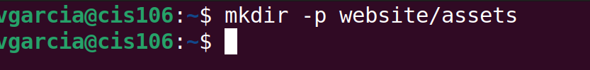 
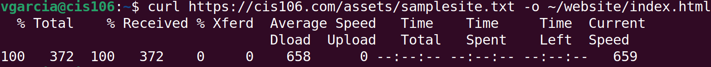 
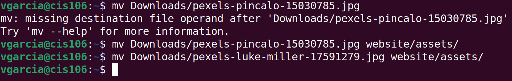 
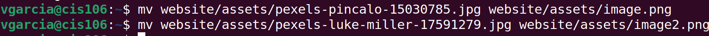 
 
 

#Practice 4
 
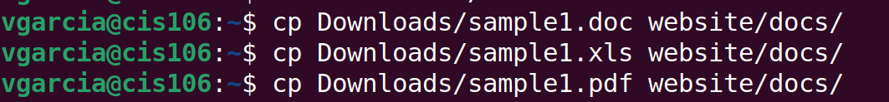 
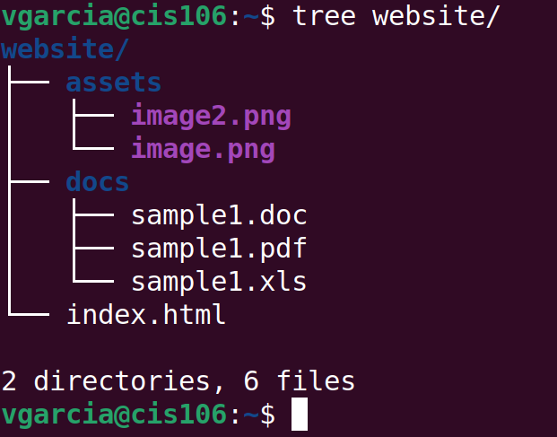 
Yes I can see the images