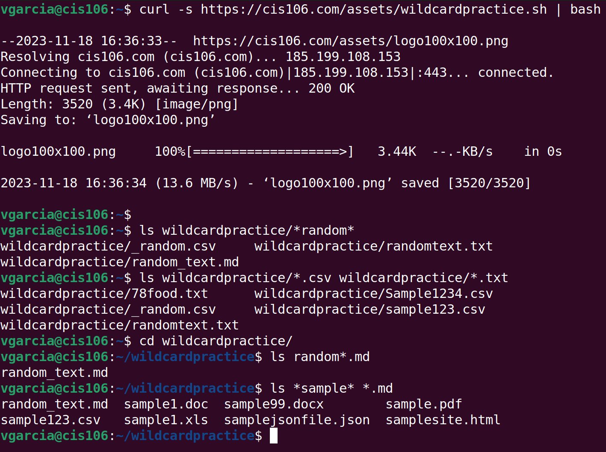
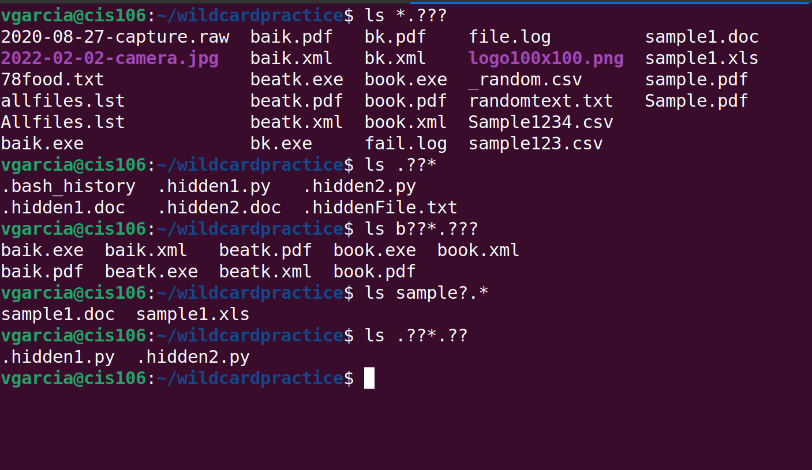
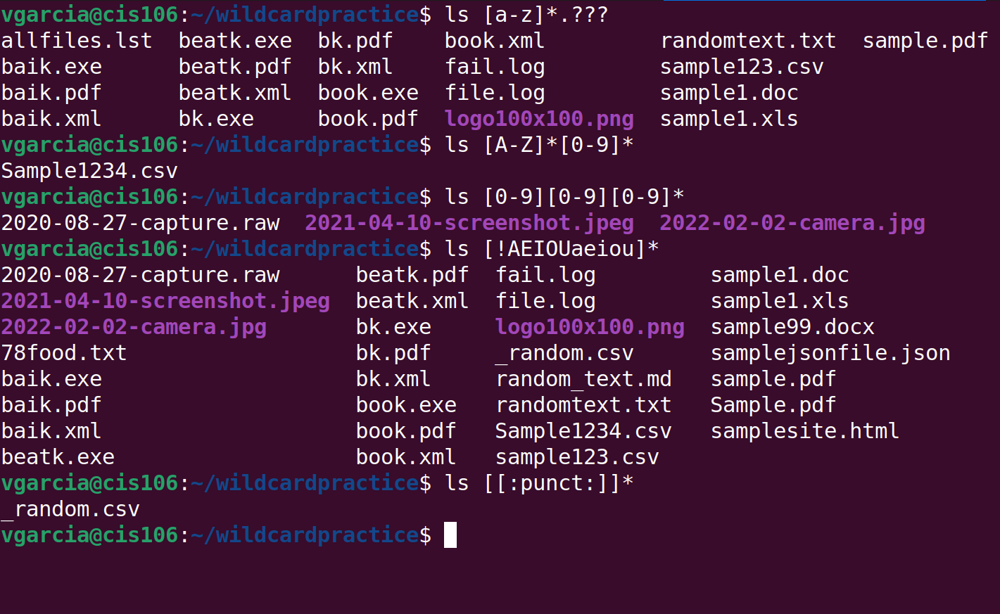

# Week Report 6

## Wildcards(3):  ?, *, [] 

### Wildcard *
   

* The main wildcard is a star or asterisk (*). Star alone matches anything & nothing & matches any number of character.
   

* Use (*) when:
* list all files w/ particular file extension
* Don't remember complete name of file but portion of name
* Want to copy, move or remove all file that match particular name
   

  * The * wildcard matches from 0 to any number of characters. 
   

    * EX: ls *.txt match all files that end in .txt regardless of size of file name
   

    * EX: *.txt* .pdf list all files that end in .txt & .pdf
   

    * EX: ls file.* list all files that start with string "file" regardless file extension. No file in directory matched. 
   

    * EX: *file.* list all files that have any letter before string "file" & after as well.
   

### Wildcard ? 
 

* The ? wildcard metacharacter matches precisely one character. Proves useful with hidden files(dot files)
 

  * EX: List all hidden files
    * ls ./.??* 
 

  * EX: List all hidden files in parent directory
    * ls ../.??*
 

  * EX: List all files that have two character b/n letter b & k
    * ls b??k* 
 

### Wildcard []
  

* The [] wildcard match a single character range.Uses exclamation mark to reverse match.For example match everything except vowels [!aeiou] or any character except number [!0-9]
 

  * EX: Match all file whose name doesn't have a number in file name
    * ls *[0-9].*
 
 * EX: Match all files whose name begins w/ any these two sets of character letter from a-f or p-z
    * ls [a-fp][0-9][$USER]
   

  * EX: Match all files whose name begins w/ any 3 combo of numbers & current username 
    * ls [0-9][0-9][0-9]$USER
   

* Practice 5
 
   

* Practice 6
 
   

* Practice 7

 

### Brace Expansion {}
   

 How to use it (3) examples?
   

* Brace expansion is not a wildcard but another feature of bash that allows to generate arbitrary string to use w/ commands. 
 

* EX: Create whole directory structure in single command:
  * mkdir -p music/{jazz,rock}/{mp3files,videos,oggfiles}/new{1..3}    
  *  

* EX: Create N number of files use:
  * touch website{1..5}.html
  * touch file{A..Z}.txt
  * touch file{001..10}.py
  * touch file{{a..z},{0..10}}.js
 

* EX: Remove multiple files in a single directory 
  * rm -r {dir1,dir2,dir3,file.txt,file.py}  

  